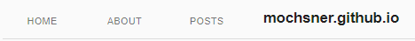
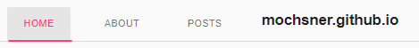

Happy extended weekend! Tonight, I got to have some fun with AngularJS in my blog, where I integrated a new Nav Menu. It's not the prettiest, but it definitely works a bit better than the older one, and will help me to re-acquaint myself with the simple, yet unique AngularJS syntax. 

Here's what the menu looks like, with it's source code further below.



  

  
  <md-content class="md-padding">
    <md-nav-bar
    md-no-ink-bar="disableInkBar"
    md-selected-nav-item="currentNavItem"
    nav-bar-aria-label="navigation links">
      <md-nav-item md-nav-href="/" name="Home">
        Home
      </md-nav-item>
      <md-nav-item md-nav-href="/about" name="About">
        About
      </md-nav-item>
      <md-nav-item md-nav-href="/posts" name="Posts">
        Posts
      </md-nav-item>
      
      &nbsp;&nbsp;mochsner.github.io
    
    </md-nav-bar>
  </md-content>

  



Beyond the Nav menu using AngularJS Material, I've also been able to get syntax highlighting working! So hopefully the previous code actually showed up colored (in monokai theme) :thumbsup:

Happy coding!

~ Moxnr
