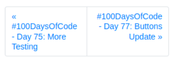

Hi friends!

Today, I got to work just a *tiny* bit on looking into org mode again (looked at my previous config), but didn't make much meaningful process because I wasn't sure if it was really something that'll be that beneficial with my current situation. I'm continously running low on RAM, and Emacs is actually a program that didn't seem to perform very well when you're using up a lot of RAM. I'll still download it and see how it performs with my workload during the week, but I decide it wasn't something really looking into on the weekend (for now).

In terms of development, I'm just now looking into the buttons for this website. I'm hoping to get them aligned on the bottom, so that when it breaks, the divs are the same size:

```css
<div class="d-flex flex-row postinator">
  
  <div class="page-item flex-fill" style="flex: 1 1 0;">
    <a class="page-link" style="text-align:left;" href="{{previous_post.url}}">&laquo; {{previous_post.title}}</a>
  </div>
  
  <div class="page-item disabled flex-fill" style="flex: 1 1 0;">
    <a class="page-link" style="text-align:left" href="#">&laquo; Previous</a>
  </div>
  
  
  
  <div class="page-item flex-fill" style="flex: 1 1 0;">
    <a class="page-link" style="text-align:right;" href="{{next_post.url}}">{{next_post.title}} &raquo;</a>
  </div>
  
  <div class="page-item disabled flex-fill" style="flex: 1 1 0;">
    <a class="page-link" style="text-align:right" href="#">Next &raquo;</a>
  </div>
  
</div>
```


And, it looks like by changing a few variables, I was able to do get it aligned! 

Here's my changes:
- Outer div class `d-flex` (bootstrap way to set `display: flex`) moved to a manual style - no effect on code
- Inner div for each button NOT changed
- Inner Link inside of inner div updated to use `height:100%` in styles

```css
<div style="display: flex;">
  
  <div class="page-item flex-fill" style="flex: 1 1 0;">
    <a class="page-link" style="text-align:left; height:100%;" href="{{previous_post.url}}">&laquo; {{previous_post.title}}</a>
  </div>
  
  <div class="page-item disabled flex-fill" style="flex: 1 1 0;">
    <a class="page-link" style="text-align:left; height:100%;" href="#">&laquo; Previous</a>
  </li>
  
  
  
  <div class="page-item flex-fill" style="flex: 1 1 0;">
    <a class="page-link" style="text-align:right; height:100%;" href="{{next_post.url}}">{{next_post.title}} &raquo;</a>
  </div>
  
  <div class="page-item disabled flex-fill" style="flex: 1 1 0;">
    <a class="page-link" style="text-align:right; height:100%;" href="{{next_post.url}}">Next &raquo;</a>
  </div>
  
</div>
```

Here's the result:



Next up, I'll be looking to separate out the &laquo; and &raquo; tags, so that they're always in the same area, even when the line wraps to the next line for a button.

Stay awesome & happy coding!

MO